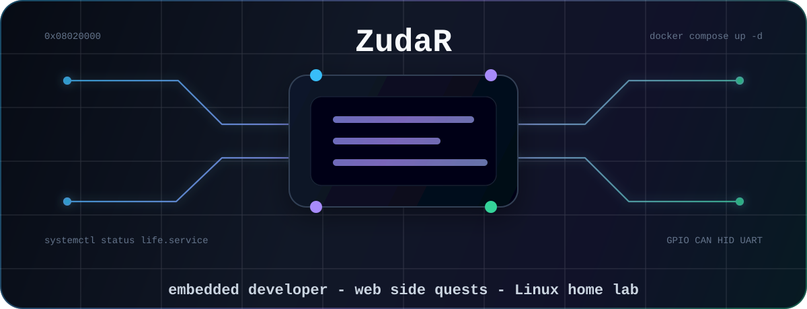

<div align="center">
  

  <h1>Daniil Zudin / ZudaR</h1>

  <p>
    <b>Embedded developer at Pandora, Kaluga</b><br/>
    Bauman MSTU - Software Engineering
  </p>

  <p>
    
    
    
    
    
    
  </p>

  <p>
    I write firmware and hardware-facing tools at work.<br/>
    On GitHub I mostly build web apps, Linux configs, guides, and self-hosted experiments.
  </p>
</div>

---

### Main directions

<table>
  <tr>
    <td width="33%">
      <b>Embedded</b><br/>
      C/C++, MCU firmware, CAN, HID, protocols, diagnostics, desktop tools around real devices.
    </td>
    <td width="33%">
      <b>Web side projects</b><br/>
      TypeScript, Next.js, PostgreSQL, Docker, CI/CD, small products that are useful in real life.
    </td>
    <td width="33%">
      <b>Linux & servers</b><br/>
      Arch and CachyOS enjoyer, VPS admin, Caddy, containers, self-hosting, practical automation.
    </td>
  </tr>
</table>

### Stack I use

<p align="left">
  
</p>

```txt
work:       embedded systems, firmware, device protocols, tooling
public:     web apps, Linux configs, guides, experiments
favorite:   Linux-first workflow, terminal, reproducible builds
principle:  keep it simple, observable, and close to the metal
```

### Featured repositories

| Repository | Why it exists |
| --- | --- |
| [`wshka`](https://github.com/zudaR107/wshka) | Wishlist app with sharing and reservations. My main public web project. |
| [`todo-app`](https://github.com/zudaR107/todo-app) | Web app playground for product/UI/backend experiments. |
| [`cachyos-configs`](https://github.com/zudaR107/cachyos-configs) | Portable CachyOS setup for a clean Linux workstation. |
| [`guides`](https://github.com/zudaR107/guides) | Short technical notes, workflows, and troubleshooting guides. |

<details>
  <summary><b>GitHub language snapshot</b></summary>
  <br/>

  [](https://github.com/zudaR107)

</details>

---

<p align="center">
  <i>Hardware is the truth. Logs are the witness. Linux is home.</i>
</p>
